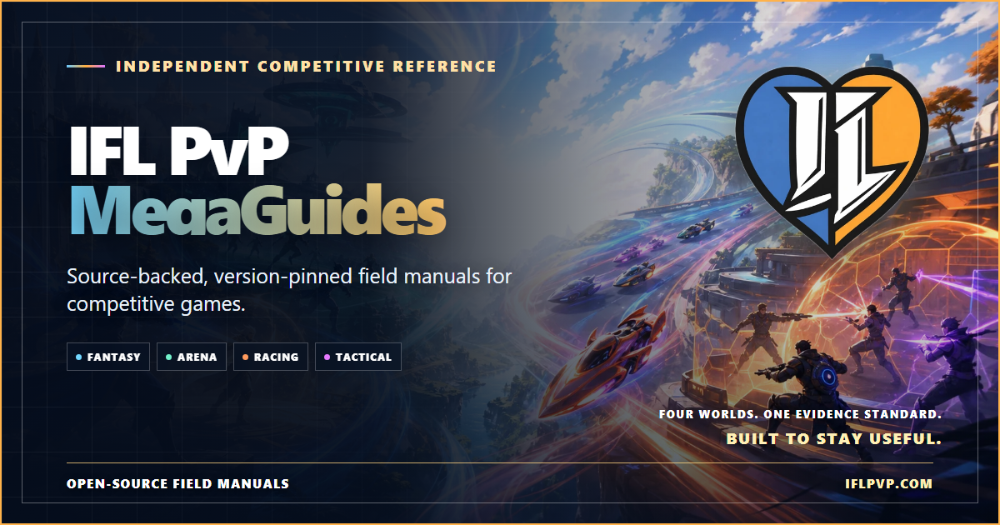
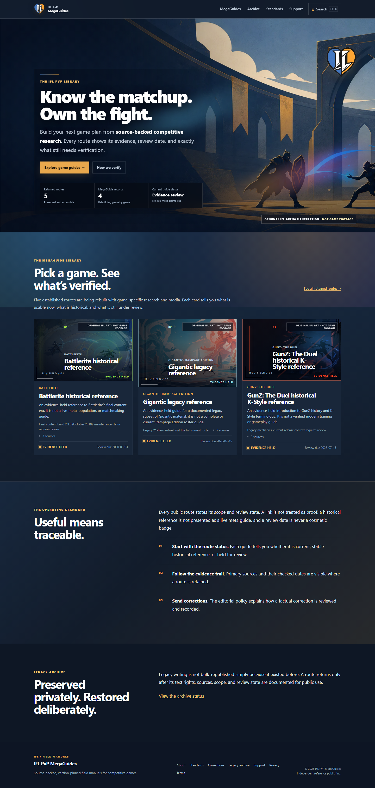
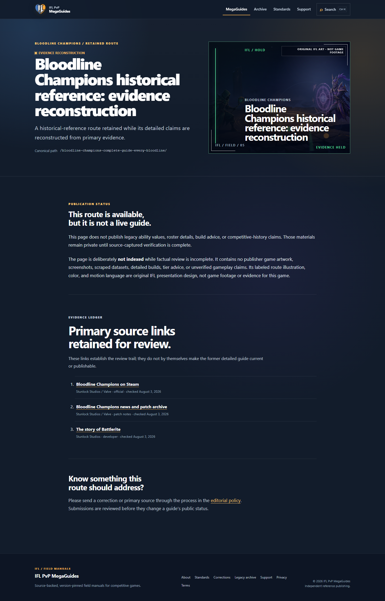

# IFL PvP MegaGuides

**Source-backed, version-pinned field manuals for competitive games.**

<p align="center">
  
</p>

<p align="center">
  <a href="https://iflpvp.com"></a>
  <a href="https://github.com/Jstn-1g/ifl-pvp-megaguides/actions/workflows/ci.yml"></a>
  <a href="https://github.com/Jstn-1g/ifl-pvp-megaguides/actions/workflows/codeql.yml"></a>
  <a href="LICENSE"></a>
</p>

IFL PvP MegaGuides is a guide-first reference site built for players who want durable answers: what a guide covers, which version it reflects, when it was reviewed, and the evidence behind material claims.

The original application and maintenance tooling in this repository are published under the MIT License. The project’s editorial library, collected data, brand assets, and third-party material are not automatically covered by that license. Start with [CONTENT-LICENSE.md](CONTENT-LICENSE.md) and [NOTICE.md](NOTICE.md) before reusing anything other than code.

## What is included

- An Astro-based static-site foundation for a guide-first reference experience.
- Deterministic local checks for build quality, accessibility, release boundaries, contributor sign-off, and dependency licensing.
- Synthetic example material, a first-party IFL identity system, an original arena hero, and distinct game-specific presentation states—no unapproved publisher art, screenshots, video, collected game data, or legacy editorial archive.
- A human-reviewed maintenance model: automation may prepare proposals, but it may not merge, deploy, or publish without maintainer approval.

The production site remains at [iflpvp.com](https://iflpvp.com). This repository deliberately does not include a live-site export or a copy of its historical media library.

## Product preview

These captures come from this repository’s first-party public interface. The design uses the reserved IFL PvP mark, an original arena hero, five labeled original route illustrations, CSS effects, and system typography; it contains no unapproved publisher artwork, game screenshots, remote fonts, or historical media.

<p>
  
  
</p>

## How it works

1. **A route declares its status.** Current, stable-historical, review-due, and unavailable states are visible rather than hidden behind a freshness badge.
2. **Material claims require evidence.** Version context, review dates, source links, and correction paths travel with the guide record.
3. **Publication fails closed.** Missing proof keeps a route available only as a clearly labeled, non-indexed evidence hold; automation cannot promote it on its own.
4. **Releases are reviewed artifacts.** DCO, rights, provenance, dependency, SEO, browser, accessibility, workflow, and clean-history gates run before a tagged build can become a release asset.
5. **Media fails closed.** Every local image and responsive candidate must exist in the built artifact and load on every generated desktop and mobile route. Game media additionally requires separate public-display and repository-redistribution grants.

## Repository map

| Path | Responsibility |
| --- | --- |
| `src/data/` | Human-reviewed public records and their source ledger |
| `src/pages/`, `src/layouts/`, `src/components/` | Static routes and the responsive Reference Grid experience |
| `governance/` | Deny-by-default content, game-media, and asset publication records |
| `scripts/` | Deterministic release, provenance, media-integrity, policy, browser, and accessibility gates |
| `.github/workflows/` | SHA-pinned CI, CodeQL, reviewed version PRs, and immutable release artifacts |
| `public/` | Reviewed first-party brand art, social preview, and LiteSpeed security-header contract |

## Repository status

This is a clean, fresh-history public codebase. Its [public-release attestation](governance/PUBLIC-RELEASE-ATTESTATION.md) records the initial reviewed content baseline and signed launch record. Its custom social preview is generated deterministically from reviewed first-party assets, hash-pinned in the asset allowlist, and contains no publisher screenshot or game media.

## Local development

Requirements: Node.js 24 or newer and npm.

```bash
npm ci
npm run dev
```

Before opening a pull request, run the checks relevant to the change:

```bash
npm run public:boundary
npm run policy:dco
npm run licenses:check
npm run workflows:check
npm run check
npm test
npm run build
npm run qa:media
```

The full release sequence is `npm run release:gate`. It is intentionally fail-closed: passing a normal build is not authorization to publish a release, asset, article, or deployment.

## Contribution rules

Read [CONTRIBUTING.md](CONTRIBUTING.md), [DCO.md](DCO.md), [CODE_OF_CONDUCT.md](CODE_OF_CONDUCT.md), and [SECURITY.md](SECURITY.md) before participating.

- Sign off each human commit with `git commit -s`.
- Disclose material AI or automation assistance and verify its output yourself.
- Submit original, MIT-compatible code only. Do not submit publisher media without the exact display and repository grants required by the [game media release policy](governance/game-media-policy.md), or submit copied writing, scraped data, private information, credentials, or assets with unclear rights.
- Use a source link or correction proposal instead of copying protected content.

## Support and contact

Optional support helps cover hosting, source review, accessibility, and preservation. It does not influence rankings, conclusions, corrections, or coverage, and is not a charitable donation or tax-deductible contribution. Current options are listed on the first-party [support page](https://iflpvp.com/support).

For rights concerns, use [NOTICE.md](NOTICE.md). For security vulnerabilities, use [SECURITY.md](SECURITY.md), not a public issue.
